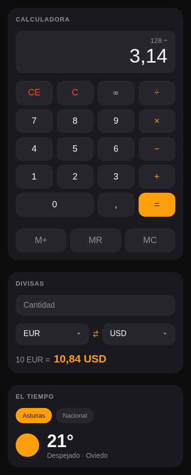
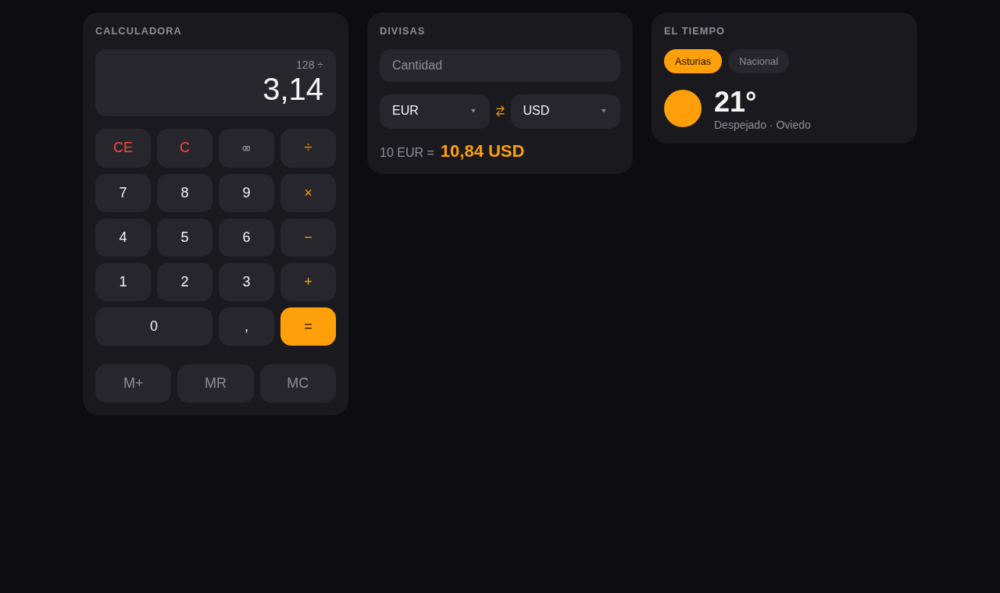

# vue-multitool

Calculadora, conversor de divisas y el tiempo de Oviedo en una sola vista. Ejercicio del bootcamp fullstack de Factoría F5, hecho con Vue 3 y diseño mobile first.

**Demo:** https://iulian640.github.io/vue-multitool/

## Qué hace

- **Calculadora**: suma, resta, multiplicación y división, con coma decimal, CE/C, retroceso y control de errores (división por cero incluida). Funciona también con el teclado físico. Las teclas M+/MR/MC guardan y recuperan un número usando un store de Pinia.
- **Conversor de divisas**: convierte entre EUR, USD y JPY con las tasas de [currencyfreaks.com](https://currencyfreaks.com/).
- **El tiempo**: temperaturas y estado del cielo de Oviedo desde la API de [el-tiempo.net](https://www.el-tiempo.net/api), con un icono animado que cambia según el `stateSky`.

## Mockups

Diseño previo de la vista única (mobile first, tres módulos: calculadora, divisas y el tiempo).

| Móvil (390px) | Escritorio (≥900px) |
| --- | --- |
|  |  |

## Stack

- Vue 3 con Composition API y `<script setup>`
- Pinia para la memoria de la calculadora
- Axios para las llamadas a las APIs
- Vitest + Vue Test Utils para los tests unitarios
- Playwright para los tests E2E
- CSS plano con design tokens (sin frameworks de estilos)

## Arrancar en local

```sh
npm install
```

El conversor necesita una API key gratuita de [currencyfreaks.com](https://currencyfreaks.com/). Crea un fichero `.env` en la raíz:

```
VITE_CURRENCYFREAKS_API_KEY=tu_api_key
```

Y arranca el servidor de desarrollo:

```sh
npm run dev
```

## Tests

```sh
# Unitarios (38 tests: calculadora, divisas y tiempo, con los servicios mockeados)
npm run test:unit -- --run

# E2E (4 tests con las APIs interceptadas, no necesitan red ni API key)
npx playwright install chromium   # solo la primera vez
npm run test:e2e -- --project=chromium
```

## Deploy

Cada push a `main` construye la app y la publica en GitHub Pages mediante GitHub Actions (`.github/workflows/deploy.yml`). La API key entra en la build desde un secret del repositorio.

## Créditos

Los iconos del tiempo son [Meteocons](https://github.com/basmilius/weather-icons) de Bas Milius (licencia MIT).
